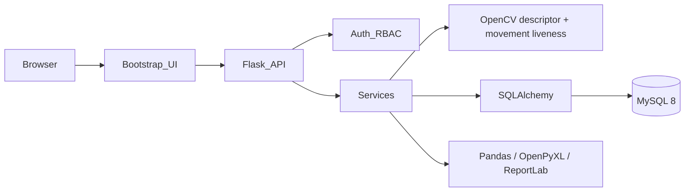

# AI-Powered Smart Attendance System with Face Recognition, Liveness Detection and Analytics

A production-style BCA final-year prototype for consented, face-assisted classroom attendance. It has a modular Flask REST API, MySQL-ready SQLAlchemy models, RBAC, encrypted face descriptors, a real OpenCV image-analysis pipeline, movement-challenge liveness, transactional duplicate protection, audit logs, anomaly flags, real-data analytics, and report export.

> **Biometric notice:** this is a decision-support prototype, not a claim of biometric-security certification. Obtain institutional approval and informed consent before enrollment. Use TLS, a separately managed `BIOMETRIC_ENCRYPTION_KEY`, MySQL backups, and a validated presentation-attack-detection model in any live deployment.

## Architecture



## Key workflows

- **Enrollment:** privileged staff submit a JPEG/PNG; OpenCV requires exactly one sufficiently sharp face, creates a normalized DCT descriptor, encrypts it, and never returns it through the API.
- **Recognition:** a camera frame is compared against enrolled descriptors. The service reports `RECOGNIZED`, `UNKNOWN`, or `UNCERTAIN`; boundary cases never auto-mark attendance.
- **Liveness:** the browser supplies centers from two independently captured challenge frames. Enough movement gives `LIVE`; otherwise it is `SPOOF_SUSPECTED` or `UNCERTAIN` and attendance is blocked.
- **Attendance:** application checks are backed by `UNIQUE(student_id, session_id)`, so concurrent requests cannot duplicate a mark.
- **Analytics:** values are calculated from stored records; no dashboard metric is fabricated.

## Project layout

```text
app/                 Flask factory, API, models, services, AI and security helpers
database/schema.sql  MySQL/migration bootstrap notes
scripts/seed.py      Explicit-password development data only
tests/               Core authentication, student, session tests
docs/                Report and diagrams
VIVA.md              Viva questions and BCA-level answers
```

## Setup (Windows, macOS, Linux)

1. Install Python 3.11+ and MySQL 8. Create a database/user with least privilege.
2. Create and activate a virtual environment: `python -m venv .venv` then `.venv\Scripts\activate` (Windows) or `source .venv/bin/activate` (macOS/Linux).
3. `pip install -r requirements.txt`
4. `cp .env.example .env` (Windows: `copy .env.example .env`) and set `DATABASE_URL`, `SECRET_KEY`, and a Fernet `BIOMETRIC_ENCRYPTION_KEY` (`python -c "from cryptography.fernet import Fernet; print(Fernet.generate_key().decode())"`).
5. Migrate: `flask --app app.py db init`, `flask --app app.py db migrate -m "initial schema"`, `flask --app app.py db upgrade`.
6. For a demo only, set a password in your shell and run `python scripts/seed.py`; it refuses to embed a production credential in source.
7. Start: `python app.py`, then open `http://localhost:5000`.

## Demonstration procedure

1. Sign in as a created super administrator and create department, course, subject, and student records through API/admin tooling.
2. Enroll each consented student with clear, single-face camera captures at `/api/face/enroll`.
3. Faculty starts an in-scope attendance session via `/api/attendance/start-session`.
4. On the live page, capture the prompted head movement twice and submit the current image to `/api/attendance/recognize`.
5. Demonstrate an unknown, blurred, or no-movement frame: it must not be marked and may be flagged for review.
6. Re-submit a recognized student: the database rejects duplicate attendance.
7. View `/api/analytics/overview`, student reports, and download `/api/reports/attendance.csv`.

## API summary

| Endpoint | Permission | Purpose |
|---|---|---|
| `POST /api/auth/login` | Public, rate limited | Session login |
| `GET/POST /api/students` | Faculty/Admin; Admin | Paginated management |
| `PATCH/DELETE /api/students/:id` | Admin | Update / soft deactivate |
| `POST /api/face/enroll` | Admin | Encrypted descriptor enrollment |
| `POST /api/attendance/start-session` | Faculty/Admin | Creates UUID session |
| `POST /api/attendance/recognize` | Faculty/Admin | Recognizes, checks liveness, marks |
| `GET /api/analytics/overview` | Logged-in | Calculated KPI data |
| `GET /api/reports/student/:id` | Owner or staff | Student attendance calculation |

Responses consistently use `{ "success": boolean, "message": string, "data": object }`.

## Tests

Run `pytest -q`. The suite covers valid/invalid authorization, protected routes, student duplicate/deactivation behavior, and session creation. Extend it with actual capture fixtures before production.

## Security and privacy limitations

- Passwords are hashed; SQLAlchemy parameterizes queries; upload MIME and size are checked; authentication is rate limited; cookies are HTTP-only/SameSite; audit data excludes passwords/descriptors.
- Configure HTTPS and `SESSION_COOKIE_SECURE=true` in production. Use a shared rate-limit store rather than memory.
- The DCT descriptor and Haar detector are a lightweight, genuine baseline suitable for a laptop demo, **not** an accuracy or anti-spoofing guarantee. Calibrate thresholds on consented local data and replace it with a maintained, independently evaluated embedding/PAD stack for sensitive deployment.
- Retention periods, lawful basis, consent, access/deletion requests, disability alternatives, bias assessments, and institutional policies remain the deploying institution's responsibility.
