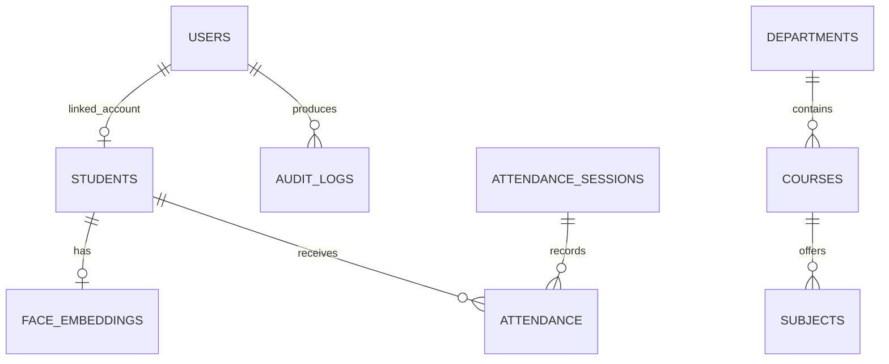
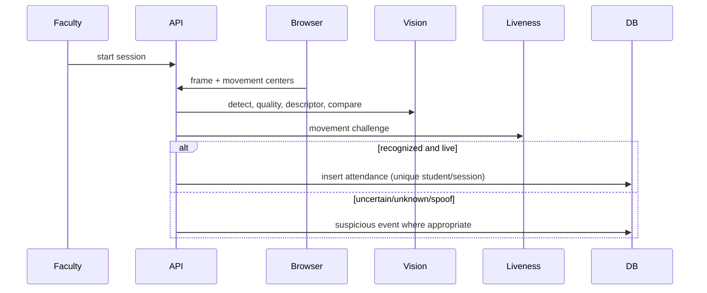
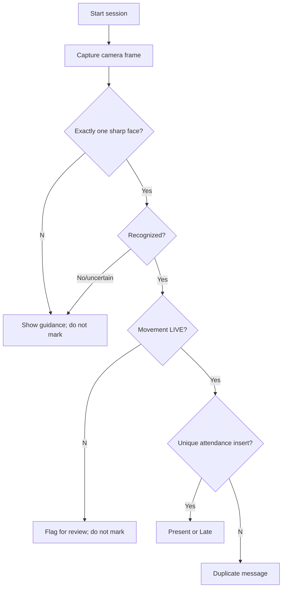
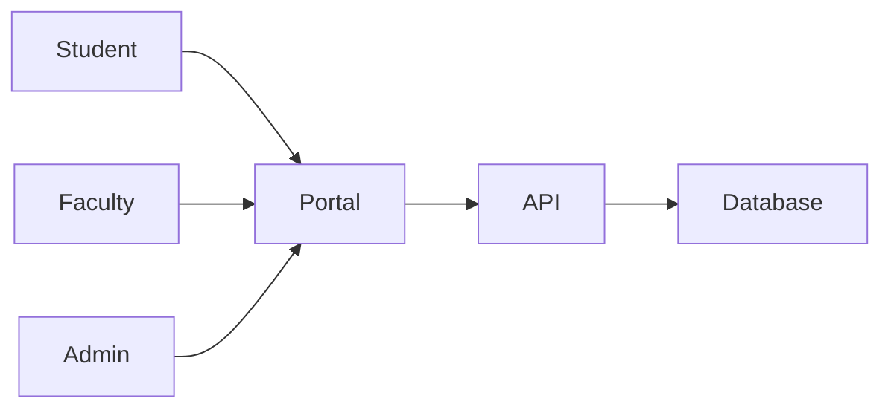
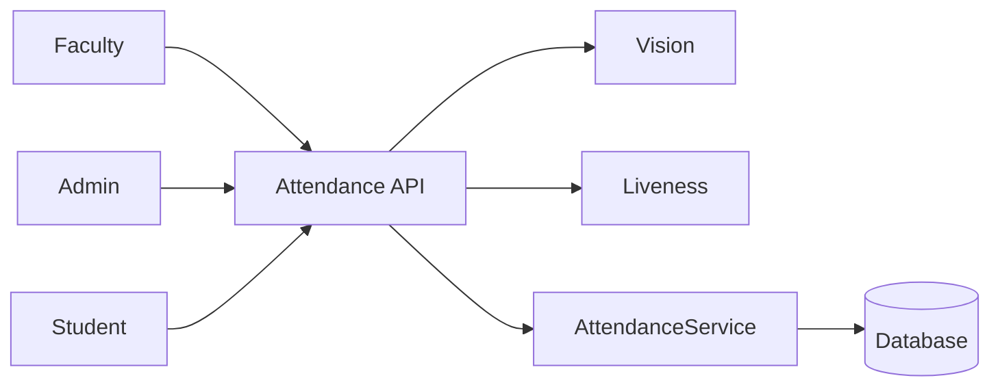
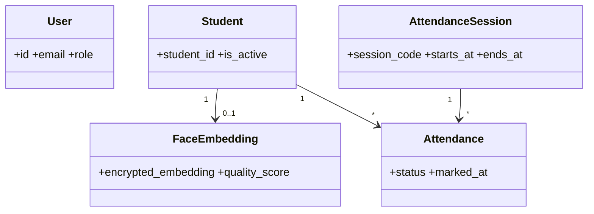
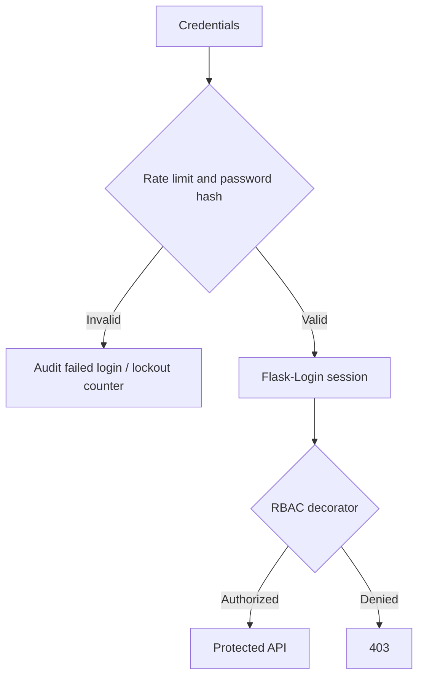
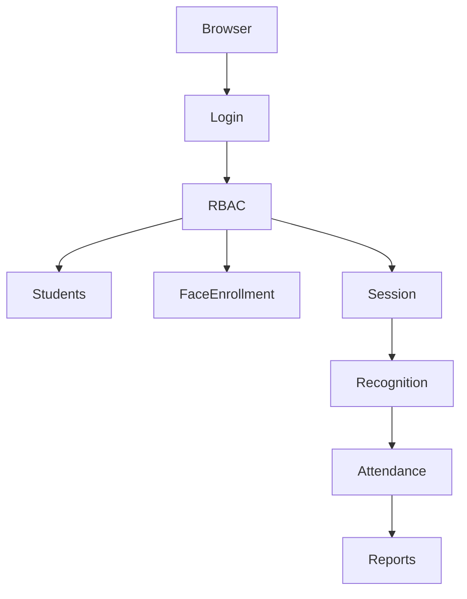

# BCA Project Report: Campus Presence

## Abstract
Campus Presence reduces manual attendance work through consented face-assisted capture while preserving a review path for uncertain results. Flask exposes role-protected APIs; SQLAlchemy persists transactional records; OpenCV performs local face quality/detection and descriptor comparison; a movement challenge provides basic liveness evidence.

## Problem, proposed system and feasibility
Paper registers are slow, duplicate-prone, and delay shortage analysis. The proposed system creates scoped sessions, rejects low-quality/multiple/uncertain faces, records only successful live recognition, and provides reports. It is technically feasible on an 8 GB RAM laptop and economically feasible for a prototype; operational feasibility depends on staff training, consent, camera placement, and an alternative attendance route.

## Functional and non-functional requirements
Functional modules include session login/RBAC, student soft-deactivation, enrollment, session creation, recognition, liveness, attendance, CSV reports, audit logs, and anomaly flags. Non-functional requirements include confidentiality, bounded upload sizes, responsive UI, structured errors, maintainability, and transactional integrity.

## Data design
`Department → Course → Subject`, `Student → FaceEmbedding`, `AttendanceSession → Attendance`, and `Student → Attendance` are normalized relations. The unique `(student_id, session_id)` constraint prevents duplicate attendance even under concurrent requests. Cancelled sessions are excluded from percentage calculations.

## Algorithms
1. Decode a JPEG/PNG frame; Haar detection must find exactly one 80px+ face.
2. Reject blur using Laplacian variance; resize the crop and produce a normalized 16×16 DCT descriptor.
3. Decrypt descriptors only in the service and choose the minimum Euclidean distance. Threshold/boundary logic yields recognized/unknown/uncertain.
4. Verify distance between two prompted face centers. Only `LIVE + RECOGNIZED` can enter attendance.

## Security, privacy and limitations
Passwords use salted hashes, RBAC protects APIs, CSRF protection applies to browser forms, rate limits protect login, and descriptors are encrypted at rest. Raw images and descriptors are not logged. Haar/DCT and movement checks do not defeat every presentation attack and can have demographic/environmental failure modes. A supervised alternative and manual correction with audit reason are required.

## Results and future enhancements
The prototype demonstrates live-only automated marking, DB-enforced de-duplication, low-attendance projection, and record-derived reporting. Future work: evaluated embedding/PAD model, WebAuthn for staff, Redis limits, signed object storage, queue-based exports, and model fairness monitoring.

## Diagrams

